# AI Compute Fabric

> **An AI-aware compute control plane for scheduling, executing, observing, and managing GPU and AI workloads across self-hosted and managed compute.**

AI Compute Fabric is an end-to-end **AI infrastructure engineering project** built to explore the layer between AI workloads and raw compute infrastructure.

Instead of treating GPUs as generic Kubernetes capacity, the platform introduces an AI-aware control plane responsible for:

- workload admission
- priority-based queueing
- GPU-aware placement
- accelerator allocation
- persistent job lifecycle management
- workload execution
- runtime observation and reconciliation
- training and inference
- durable model artifacts
- AI infrastructure observability
- managed inference
- AI-assisted infrastructure operations

The platform was validated on **real AWS infrastructure using Amazon EKS and an NVIDIA Tesla T4 GPU**, including real PyTorch training, 4-bit QLoRA fine-tuning, vLLM inference serving, AWS Bedrock managed inference, GPU telemetry, MCP-based Kubernetes operations, and durable model artifact publication to Amazon S3.

---

# 1. Why This Project Exists

Kubernetes is excellent at orchestrating containers, but an AI compute platform needs to reason about concepts that exist above ordinary container scheduling.

An AI workload may care about:

- GPU type
- available VRAM
- accelerator health
- GPU utilization
- workload priority
- training vs. inference lifecycle
- model requirements
- accelerator reservation
- model artifacts
- runtime state
- inference provider selection

The purpose of AI Compute Fabric is therefore not to replace Kubernetes.

It adds an **AI-aware compute control plane above the infrastructure layer**.

A useful way to describe the relationship is:

```text
Kubernetes schedules infrastructure resources.

AI Compute Fabric schedules AI workload intent.
```

The platform determines whether a workload should be accepted, when it should be considered, which GPU should receive it, how accelerator state should be tracked, and how its lifecycle should be observed.

Kubernetes remains the execution substrate responsible for materializing the resulting workload.

---

# 2. What Makes It Different

This project is not simply:

```text
FastAPI + Kubernetes + GPU
```

and it is not a collection of Kubernetes manifests wrapped around an ML container.

The architecture was deliberately built as a control plane first.

```text
AI Workload
     ↓
Platform API
     ↓
Job Orchestrator
     ↓
Admission Controller
     ↓
Priority Queue
     ↓
Queue Processor
     ↓
AI-Aware Scheduler
     ↓
GPU / Resource Manager
     ↓
Workload Runner
     ↓
Execution Infrastructure
```

Infrastructure-specific behavior remains behind adapters.

This produces several important boundaries:

```text
Admission   = Should the workload enter the system?

Queue       = When should it be considered?

Scheduler   = Which available GPU should receive it?

GPU Manager = Who owns logical accelerator allocation?

Runner      = How should the workload be materialized?

Observer    = What is actually happening at runtime?

Reconciler  = Does platform state match infrastructure state?
```

The project was then progressively connected to real AWS infrastructure and validated with actual AI workloads.

---

# 3. Architecture

## High-Level Architecture

```text
                         ┌─────────────────────────────┐
                         │      Client / Operator      │
                         └──────────────┬──────────────┘
                                        │
                                   REST API / MCP
                                        │
                                        ▼
┌─────────────────────────────────────────────────────────────────────┐
│                    AI COMPUTE CONTROL PLANE                         │
│                                                                     │
│   ┌────────────────────┐                                            │
│   │ Admission Controller│                                           │
│   └─────────┬──────────┘                                            │
│             │                                                       │
│             ▼                                                       │
│       ┌─────────────┐                                               │
│       │ Job Manager │──────────────→ PostgreSQL                     │
│       └──────┬──────┘                                               │
│              │                                                      │
│              ▼                                                      │
│       ┌──────────────┐                                              │
│       │Priority Queue│                                              │
│       └──────┬───────┘                                              │
│              │                                                      │
│              ▼                                                      │
│       ┌──────────────┐                                              │
│       │Queue Processor│                                             │
│       └──────┬───────┘                                              │
│              │                                                      │
│              ▼                                                      │
│   ┌────────────────────────┐                                        │
│   │   AI-Aware Scheduler   │                                        │
│   │                        │                                        │
│   │ • GPU type filtering   │                                        │
│   │ • VRAM constraints     │                                        │
│   │ • GPU state            │                                        │
│   │ • Placement scoring    │                                        │
│   └───────────┬────────────┘                                        │
│               │                                                     │
│               ▼                                                     │
│   ┌────────────────────────┐                                        │
│   │ GPU / Resource Manager │                                        │
│   └───────────┬────────────┘                                        │
│               │                                                     │
│               ▼                                                     │
│        ┌─────────────┐       Dynamic GPU Agent                      │
│        │GPU Inventory│◀───────────────────────                      │
│        └──────┬──────┘                                              │
│               │                                                     │
│               ▼                                                     │
│       ┌─────────────────┐                                           │
│       │ Workload Runner │                                           │
│       └────────┬────────┘                                           │
│                │                                                    │
│        Runtime Observation                                          │
│        + Reconciliation                                             │
└────────────────┼────────────────────────────────────────────────────┘
                 │
                 ▼
┌─────────────────────────────────────────────────────────────────────┐
│                         COMPUTE LAYER                               │
│                                                                     │
│                       Kubernetes / EKS                              │
│                              │                                      │
│                 ┌────────────┼────────────┐                         │
│                 │            │            │                         │
│                 ▼            ▼            ▼                         │
│              PyTorch       QLoRA         vLLM                       │
│              Training    Fine-Tuning   Inference                    │
│                                                                     │
│                       NVIDIA Tesla T4                               │
└─────────────────────────────────────────────────────────────────────┘
```

Additional platform paths extend this architecture:

```text
QLoRA Training                     Managed Inference
      │                                  │
      ▼                                  ▼
Artifact Publisher                 ManagedInferenceService
   ┌──┴─────────┐                         │
   │            │                         ▼
   ▼            ▼                  BedrockProvider
Amazon S3   Artifact API                  │
                │                         ▼
                ▼                    AWS Bedrock
            PostgreSQL
```

And observability spans both the control plane and infrastructure:

```text
GPU Telemetry ─────────┐
                      │
Scheduler Metrics ─────┼────→ Prometheus ────→ Grafana
                      │
Job Lifecycle ─────────┘
```

---

# 4. Core Control Plane

The core control plane coordinates workload intent without directly embedding infrastructure behavior into the scheduler.

Its main components include:

### Platform API

Provides the external boundary for workload submission, lifecycle operations, artifact access, managed inference, and operational integrations.

### Job Orchestrator

Coordinates admission, persistence, queueing, scheduling, workload execution, and lifecycle transitions.

### Admission Controller

Validates whether a workload is acceptable before it enters scheduling.

Examples of validated constraints include GPU memory requirements and priority values.

### Job Manager

Owns job lifecycle operations and persists state through a repository abstraction.

### Priority Queue

Separates workload acceptance from scheduling order.

### Queue Processor

Processes pending workloads and asks the scheduler for placement.

### Scheduler

Evaluates currently available GPU resources and returns a scheduling decision.

### GPU Manager

Owns logical accelerator allocation and release.

### Workload Runner

Converts an accepted scheduling decision into infrastructure execution.

### Runtime Observation

Observes actual workload state after materialization.

### Reconciliation

Brings persisted control-plane state back into alignment with infrastructure reality.

---

# 5. Scheduling Model

Scheduling was deliberately separated into multiple responsibilities.


```text
Submission
    ↓
Admission
    ↓
Persist Job
    ↓
Enqueue
    ↓
Queue Processor
    ↓
Scheduler
    ↓
GPU Filtering
    ↓
Placement Scoring
    ↓
SchedulingDecision
    ↓
GPU Allocation
```
### AI-Aware Scheduling to Real GPU Execution

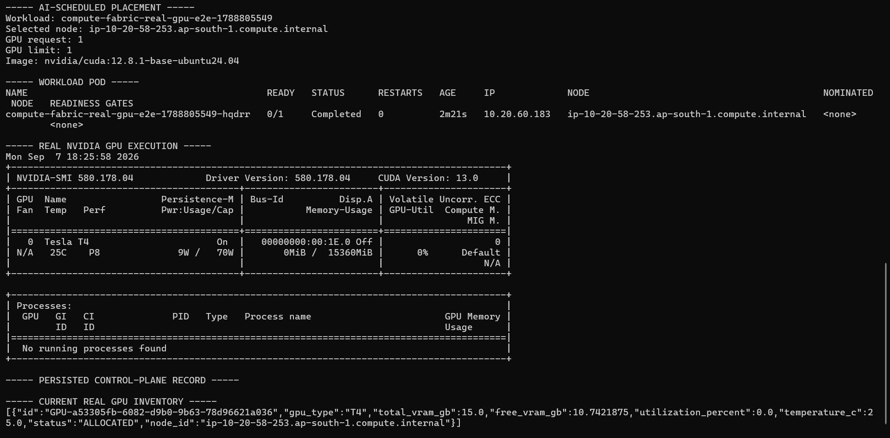

*End-to-end scheduling proof: AI Compute Fabric selects a real EKS GPU node, materializes a GPU-requesting Kubernetes workload, executes on an NVIDIA Tesla T4, persists the placement, and records the accelerator as logically ALLOCATED.*

The scheduler considers factors including:

```text
Requested GPU Type
Required VRAM
GPU Availability
GPU State
Free VRAM
Utilization
Placement Score
```

A scheduling decision contains placement information such as:

```text
Job ID
GPU ID
Node ID
Workload ID
Placement Score
```

The scheduler does **not** call Kubernetes.

Its output is a placement decision.

Execution occurs afterward through the workload-runner boundary.

### Scheduling and Persistent Job State

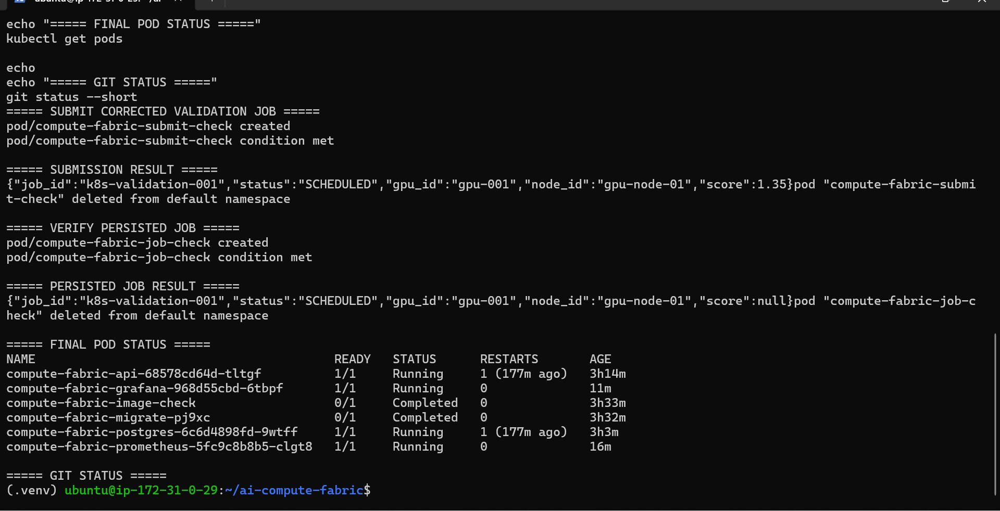

*Control-plane validation showing a submitted job progressing to SCHEDULED with GPU/node placement and the scheduling result subsequently retrieved from persistent job state.*

---

# 6. GPU Resource Model

GPUs are represented as first-class control-plane resources.

A GPU contains information such as:

```text
GPU ID
GPU Type
Total VRAM
Free VRAM
Utilization
Temperature
Status
Node ID
```

GPU lifecycle states include:

```text
AVAILABLE
ALLOCATED
UNHEALTHY
DRAINING
```

This allows the platform to distinguish physical accelerator telemetry from logical scheduling state.

The GPU Manager owns allocation semantics:

```text
AVAILABLE
    ↓
Scheduler selects GPU
    ↓
ALLOCATED
    ↓
Workload executes
    ↓
Terminal lifecycle state
    ↓
GPU released
    ↓
AVAILABLE
```

The scheduler therefore cannot silently consume accelerator capacity without the resource-management layer recording the allocation.

---

# 7. Persistence & State

Job state is persisted independently of orchestration logic.

```text
JobManager
    ↓
JobRepository
    ├── InMemoryJobRepository
    └── PostgresJobRepository
```
### Durable Control-Plane Persistence

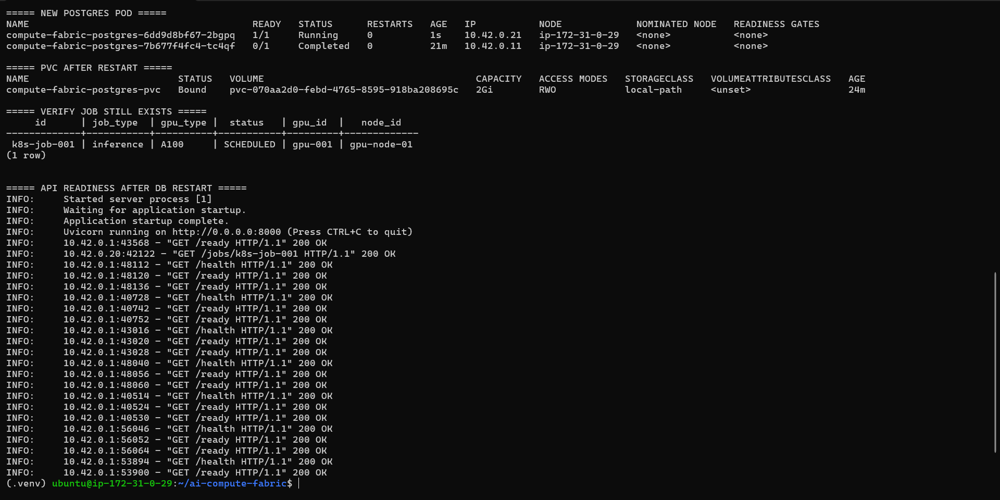

*PostgreSQL-backed control-plane state survives a database Pod restart through persistent Kubernetes storage, with the previously scheduled job recovered and API health/readiness restored.*

PostgreSQL provides durable control-plane state for real deployments.

The workload lifecycle includes:

```text
PENDING
SCHEDULED
RUNNING
COMPLETED
FAILED
CANCELLED
```

Persisted execution information includes workload placement and runtime identifiers.

Database schema evolution is managed with **Alembic**.

The artifact subsystem follows the same architectural pattern:

```text
ArtifactService
      ↓
ArtifactRepository
      ├── repository contract
      └── PostgresArtifactRepository
```

This keeps persistence concerns outside core domain logic.

---

# 8. Execution Architecture

The execution subsystem was intentionally introduced **after** the scheduler.

The boundary is:

```text
Scheduler
    ↓
SchedulingDecision
    ↓
WorkloadRunner
    ↓
Infrastructure Adapter
    ↓
Runtime Workload
```

The Kubernetes implementation converts platform workload specifications into Kubernetes resources.

Two lifecycle modes are supported.

## Batch Workloads

Used for finite jobs such as:

```text
PyTorch Training
QLoRA Fine-Tuning
```

These are materialized as Kubernetes Jobs.

## Service Workloads

Used for long-running workloads such as:

```text
vLLM Inference
```

These are materialized through Kubernetes Deployment/Service resources.

This allows one compute control plane to support both training and inference without teaching the scheduler about Kubernetes object types.

---

# 9. Real AWS / EKS Infrastructure

The control plane was deployed and validated on real AWS infrastructure.

Infrastructure included:

### Real NVIDIA Tesla T4 on Amazon EKS

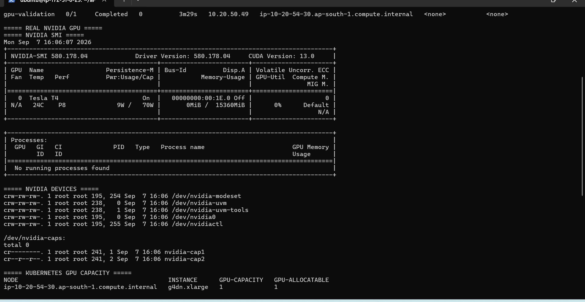

*Real Amazon EKS GPU node validation showing an NVIDIA Tesla T4, CUDA-capable NVIDIA runtime, and one GPU exposed as Kubernetes capacity and allocatable compute.*

```text
AWS
│
├── VPC
│   ├── Public Subnets
│   └── Private Subnets
│
├── Internet Gateway
├── NAT Gateway
│
├── Amazon EKS
│   ├── CPU Managed Node Group
│   └── GPU Managed Node Group
│
├── NVIDIA Device Plugin
├── EBS CSI Driver
├── IAM / IRSA
│
└── Amazon S3
```

The GPU node group used:

```text
Instance Type: g4dn.xlarge
Accelerator:   NVIDIA Tesla T4
GPU Count:     1
```

The GPU node group supported:

```text
min     = 0
desired = 0 or 1
max     = 1
```

This allowed expensive GPU infrastructure to remain at zero capacity when it was not required.

Terraform managed the AWS infrastructure lifecycle.

---

# 10. Dynamic GPU Discovery

Local development can use simulated GPU inventory.

The real EKS environment does not.

A GPU Agent runs against the Kubernetes environment and publishes real accelerator information to the control plane.

### Dynamic GPU Discovery into the Control Plane

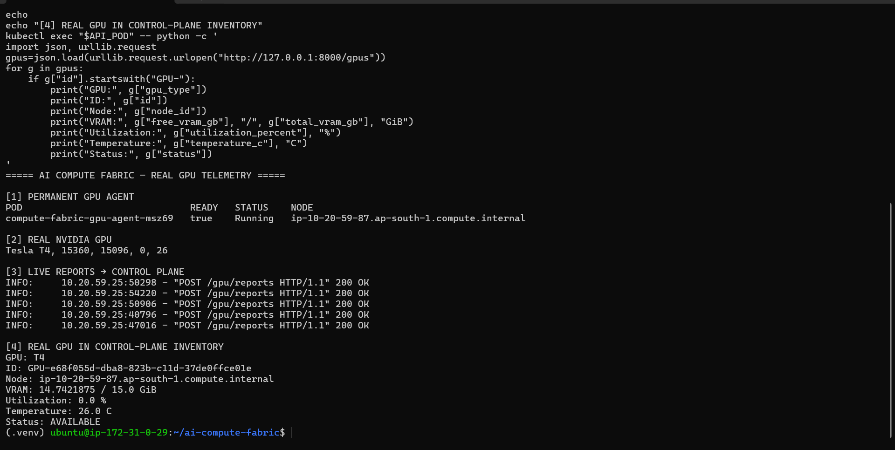

*The permanent GPU Agent reads real Tesla T4 telemetry, continuously reports it to AI Compute Fabric, and populates the control-plane GPU inventory with VRAM, utilization, temperature, node placement, and availability state.*

```text
NVIDIA GPU
     ↓
Kubernetes Node
     ↓
GPU Agent
     ↓
GPU Telemetry
     ↓
AI Compute Fabric
     ↓
GPU Inventory
     ↓
Scheduler
```

The real EKS deployment explicitly disabled simulated GPU inventory.

This ensured real scheduling decisions were based on discovered infrastructure rather than hard-coded accelerator records.

---

# 11. Runtime Observation & Reconciliation

Scheduling a workload is only the beginning of its lifecycle.

The platform observes infrastructure state after execution:

```text
SCHEDULED
    ↓
Workload created
    ↓
Runtime observation
    ↓
RUNNING
    ↓
COMPLETED / FAILED / CANCELLED
```

The reconciliation path compares persisted platform state with the actual infrastructure workload.

This allows the control plane to recover from cases where:

- workload execution progresses asynchronously
- infrastructure changes outside the initial API request
- the API process restarts
- a workload completes after scheduling
- a runtime workload fails
- terminal state requires GPU release

GPU capacity is released through lifecycle reconciliation rather than simply assuming successful execution.

---

# 12. Real PyTorch Training

The first real GPU workload validated the complete execution path using PyTorch and CUDA.

```text
API Submission
     ↓
Admission
     ↓
Priority Queue
     ↓
Scheduler
     ↓
Real Tesla T4 Placement
     ↓
GPU Allocation
     ↓
Kubernetes Job
     ↓
PyTorch
     ↓
CUDA
     ↓
Training
     ↓
Runtime Observation
     ↓
COMPLETED
     ↓
GPU Released
```
### Real PyTorch Training on NVIDIA Tesla T4

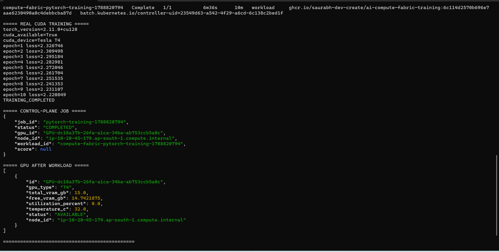

*Real PyTorch/CUDA training scheduled through AI Compute Fabric on a Tesla T4, showing decreasing training loss, terminal control-plane reconciliation to COMPLETED, and accelerator release back to AVAILABLE capacity.*

The workload executed successfully on the real NVIDIA Tesla T4 and demonstrated decreasing training loss.

This validated that scheduling decisions were not merely simulated control-plane records—they resulted in actual accelerator-backed computation.

---

# 13. QLoRA Fine-Tuning

The next workload extended the platform from synthetic training to real LLM fine-tuning.

### Real QLoRA Fine-Tuning on NVIDIA Tesla T4

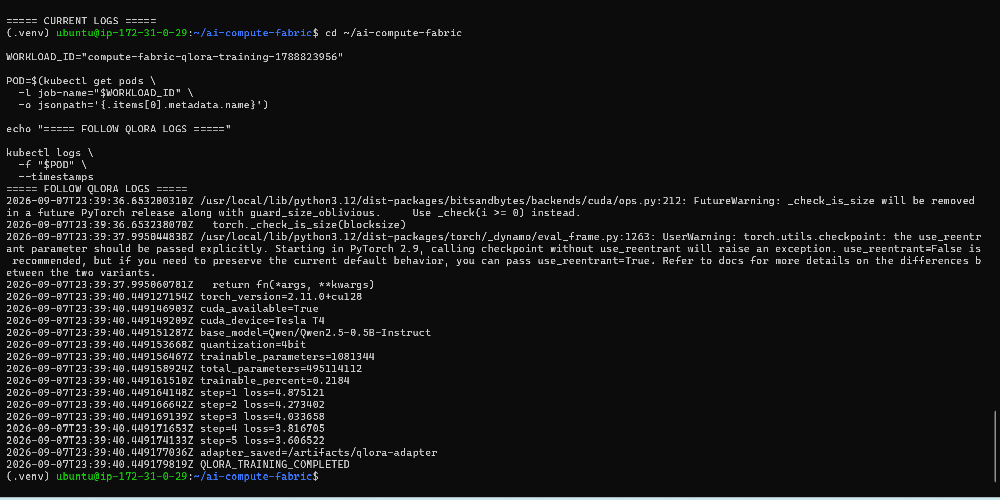

*Real 4-bit QLoRA fine-tuning of Qwen2.5-0.5B-Instruct on an NVIDIA Tesla T4, showing CUDA execution, parameter-efficient training, decreasing loss, and successful adapter generation.*

A **4-bit QLoRA** workload fine-tuned:

```text
Qwen/Qwen2.5-0.5B-Instruct
```

Real runtime evidence:

```text
torch_version=2.11.0+cu128
cuda_available=True
cuda_device=Tesla T4

base_model=Qwen/Qwen2.5-0.5B-Instruct
quantization=4bit

trainable_parameters=1081344
total_parameters=495114112
trainable_percent=0.2184
```

Observed training progression:

```text
step=1 loss=4.875121
step=2 loss=4.298939
step=3 loss=4.044377
step=4 loss=3.826257
step=5 loss=3.617788
```
### Workload Completion and GPU Reconciliation

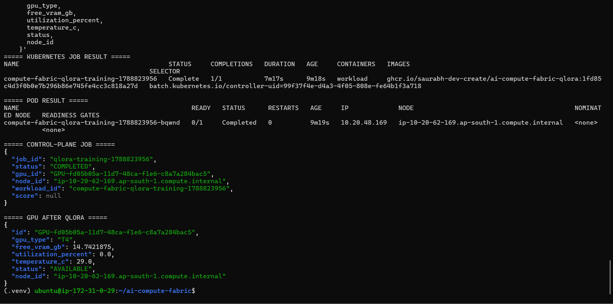

*After the Kubernetes training workload completes, AI Compute Fabric reconciles the control-plane job to COMPLETED and releases the Tesla T4 back to AVAILABLE capacity.*

The adapter was successfully produced:

```text
adapter_saved=/artifacts/qlora-adapter
```

This demonstrated real parameter-efficient fine-tuning through the same scheduling and execution architecture used by other workloads.

---

# 14. Durable Model Artifact Lifecycle

A successful training job is incomplete if its output disappears with the container.

The project therefore introduced model artifacts as a first-class platform concept.

### Durable QLoRA Artifact Registration and Retrieval

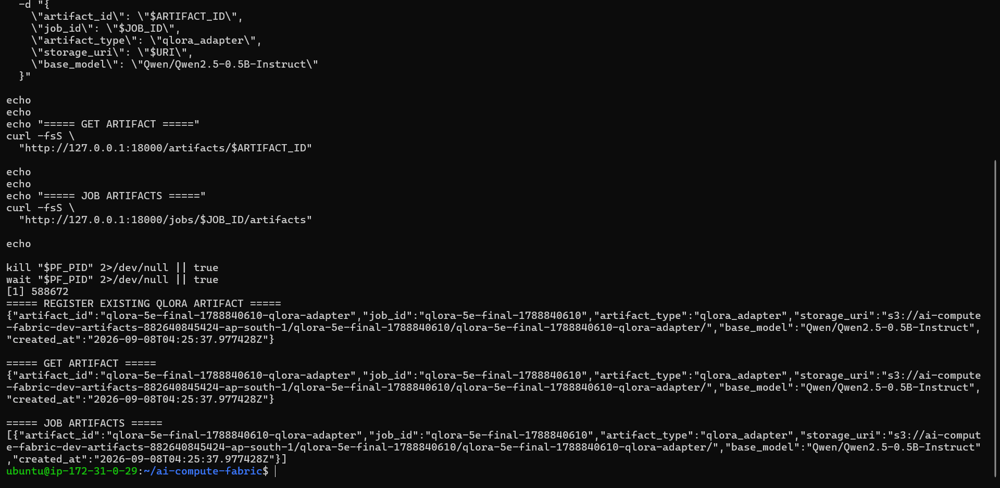

*Real QLoRA adapter registered with the artifact service and retrieved through both artifact- and job-scoped APIs, with durable Amazon S3 storage URI and base-model metadata persisted by the platform.*

```text
QLoRA
  ↓
Adapter Saved
  ↓
Artifact Publisher
  │
  ├──────────────→ Amazon S3
  │                   │
  │                   └── Durable Model Files
  │
  └──────────────→ Artifact API
                      │
                      ▼
                 ArtifactService
                      │
                      ▼
                  PostgreSQL
```

Artifact metadata contains:

```text
Artifact ID
Job ID
Artifact Type
Storage URI
Base Model
Created At
```

Artifact APIs include:

```text
POST /artifacts
GET  /artifacts/{artifact_id}
GET  /jobs/{job_id}/artifacts
```

The final real QLoRA run produced the following durable artifact chain:

```text
NVIDIA Tesla T4
      ↓
CUDA
      ↓
4-bit QLoRA
      ↓
PEFT Adapter
      ↓
IRSA
      ↓
Amazon S3
      ↓
Artifact Metadata
      ↓
PostgreSQL
      ↓
ArtifactService
      ↓
REST API
```

The S3 artifact contains real model output including:

```text
README.md
adapter_config.json
adapter_model.safetensors
added_tokens.json
chat_template.jinja
merges.txt
special_tokens_map.json
tokenizer.json
tokenizer_config.json
vocab.json
```

Workloads authenticate to S3 using **IAM Roles for Service Accounts (IRSA)** rather than embedded AWS credentials.

---

# 15. vLLM Inference

### Real vLLM Inference on NVIDIA Tesla T4

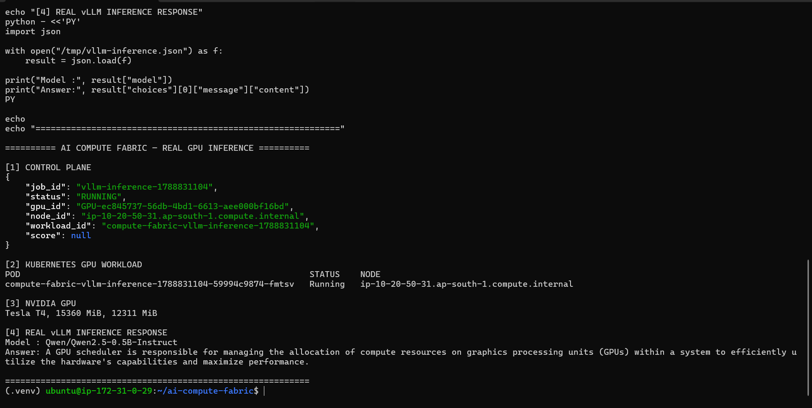

*End-to-end self-hosted inference through AI Compute Fabric: the control plane tracks the running workload, Kubernetes places it on the GPU node, an NVIDIA Tesla T4 provides accelerator capacity, and vLLM serves a real Qwen2.5-0.5B-Instruct inference response.*i

The execution layer also supports long-running model-serving workloads.

A real vLLM service was scheduled onto the Tesla T4.

```text
API
 ↓
Scheduler
 ↓
Tesla T4
 ↓
Workload Runner
 ↓
Kubernetes Deployment
 ↓
Kubernetes Service
 ↓
vLLM
 ↓
Qwen/Qwen2.5-0.5B-Instruct
 ↓
OpenAI-Compatible API
```

The endpoint successfully served real model inference.

The service lifecycle also validated an important resource invariant:

```text
Cancel workload
      ↓
Terminate Kubernetes workload
      ↓
Confirm execution termination
      ↓
Release logical GPU
```

GPU capacity is therefore not returned to the scheduler before the associated runtime workload is terminated.

---

# 16. AWS Bedrock Managed Inference

### Amazon Bedrock Model Availability

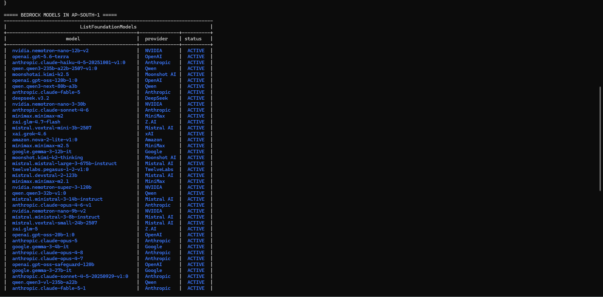

*Amazon Bedrock foundation models available to the managed-inference path in `ap-south-1`, demonstrating access to multiple model providers through AWS-managed AI infrastructure.*

AI Compute Fabric supports both self-hosted and managed AI compute.

Managed inference uses a provider abstraction:

```text
POST /managed-inference/invoke
              ↓
ManagedInferenceService
              ↓
ManagedInferenceProvider
              ↓
BedrockProvider
              ↓
AWS Bedrock Runtime
```
### Real Bedrock Managed Inference

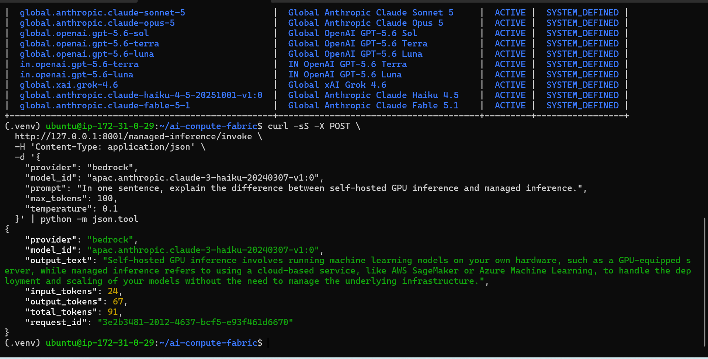

*Real end-to-end managed inference through AI Compute Fabric: the `/managed-inference/invoke` API routes a request through the Bedrock provider to an Anthropic Claude model and returns generated output, token usage, and the AWS request ID.*

Real AWS Bedrock inference was successfully validated.

The provider integration captures model response information including token usage and AWS request metadata while keeping provider-specific behavior outside the core control plane.

This produces two complementary inference paths:

```text
SELF-HOSTED                         MANAGED

AI Compute Fabric                  AI Compute Fabric
       ↓                                  ↓
Scheduler                         ManagedInferenceService
       ↓                                  ↓
GPU Manager                         Provider
       ↓                                  ↓
EKS / Tesla T4                    AWS Bedrock
       ↓
vLLM
```

The platform therefore demonstrates infrastructure patterns for both owning accelerator execution and delegating inference to a managed AI provider.

---

# 17. DevOps MCP

### MCP Tool Discovery

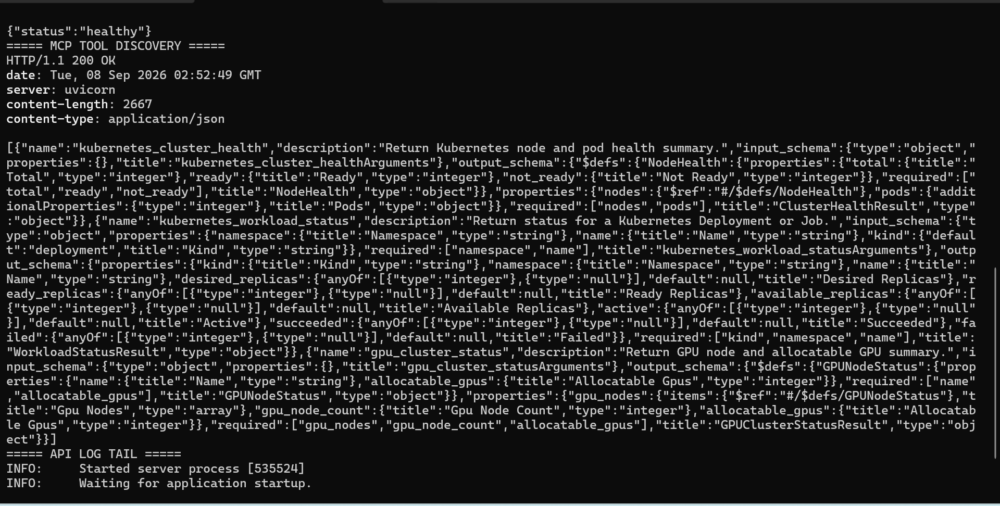

*DevOps MCP server exposing structured Kubernetes cluster health, workload status, and GPU cluster status tools through the Model Context Protocol.*

AI infrastructure also requires operational visibility and control.

The project includes a DevOps MCP integration using the official Model Context Protocol SDK.

```text
AI Compute Fabric API
        ↓
    MCPService
        ↓
 Official MCP Client
        ↓
 DevOps MCP Server
        ↓
 Kubernetes Python API
        ↓
       EKS
```

### MCP Integration with Real Amazon EKS

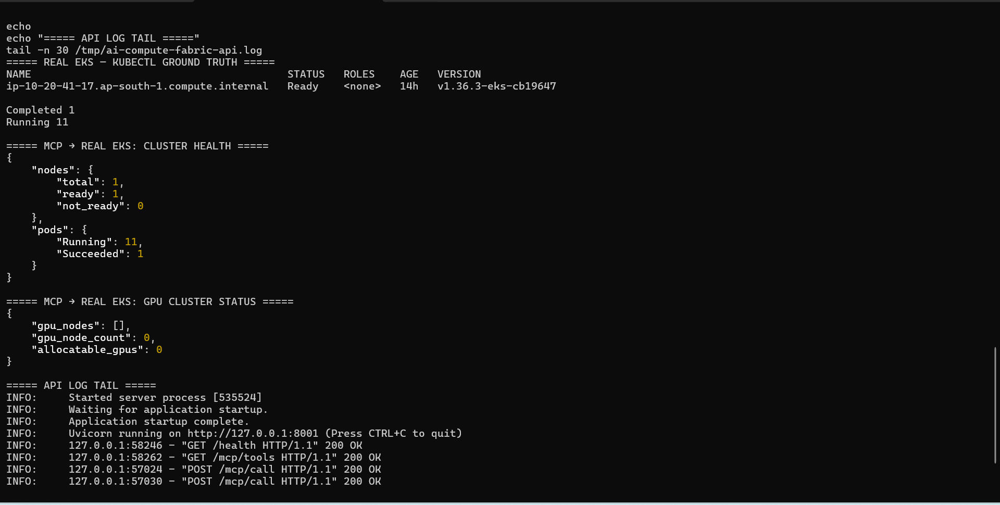

*End-to-end MCP validation against the real Amazon EKS cluster, with Kubernetes ground truth compared to MCP-reported cluster health and GPU capacity.*

Implemented tools include:

```text
kubernetes_cluster_health
kubernetes_workload_status
gpu_cluster_status
```

These tools were validated against the real EKS cluster.

The MCP boundary is intentionally separate from scheduling and execution so AI-assisted operational tooling does not become part of core workload placement logic.

---

# 18. Prometheus / Grafana Observability

### GPU Resource Observability

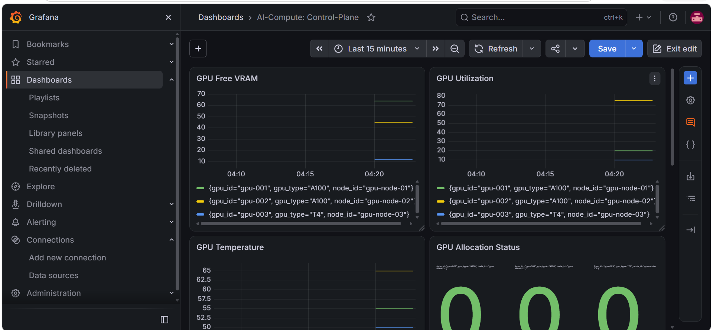

*Grafana visualization of GPU free VRAM, utilization, temperature, and allocation state, demonstrating accelerator-aware telemetry exposed by the AI Compute Fabric control plane.*

AI Compute Fabric exposes both infrastructure telemetry and control-plane behavior.

Prometheus metrics cover areas including:

### Control-Plane Scheduling Observability

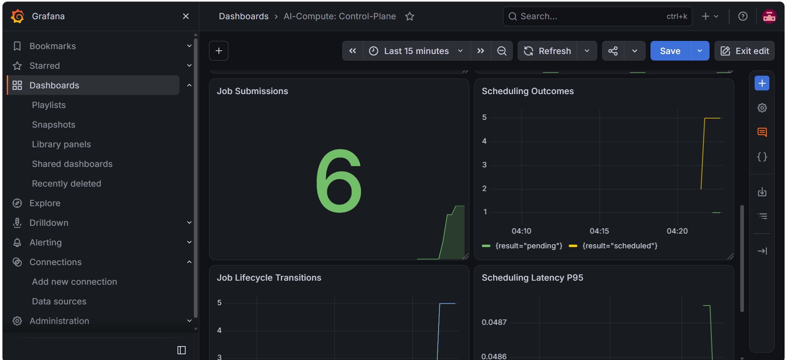

*Control-plane metrics showing workload submissions, scheduling outcomes, lifecycle transitions, and P95 scheduling latency across the AI Compute Fabric scheduling pipeline.*

```text
Job submissions
Admission rejections
Scheduling attempts
Scheduling outcomes
Lifecycle transitions
Scheduling latency

GPU total VRAM
GPU free VRAM
GPU utilization
GPU temperature
GPU allocation / health state
```

Architecture:

```text
GPU Agent ──────────────┐
                       │
Job Lifecycle ──────────┼────→ Prometheus ────→ Grafana
                       │
Scheduler ──────────────┤
                       │
GPU Manager ────────────┘
```

Grafana provides dashboards for control-plane and GPU behavior.

The observability layer makes it possible to answer both:

```text
"What is the infrastructure doing?"
```

and:

```text
"What decisions is the AI compute control plane making?"
```

That distinction is important for operating an AI infrastructure platform.

---

# 19. End-to-End Proof

The final implementation was validated through multiple real execution paths.

## Training Path

```text
API
 ↓
Admission
 ↓
Queue
 ↓
Scheduler
 ↓
Tesla T4
 ↓
Kubernetes Job
 ↓
PyTorch
 ↓
Training
 ↓
Runtime Reconciliation
 ↓
COMPLETED
 ↓
GPU Released
```

## Fine-Tuning + Artifact Path

```text
API
 ↓
Scheduler
 ↓
Tesla T4
 ↓
Kubernetes
 ↓
4-bit QLoRA
 ↓
Adapter
 ↓
IRSA
 ↓
Amazon S3
 ↓
Artifact API
 ↓
PostgreSQL
 ↓
Artifact Retrieval
```

## Self-Hosted Inference Path

```text
API
 ↓
Scheduler
 ↓
Tesla T4
 ↓
Kubernetes Deployment + Service
 ↓
vLLM
 ↓
OpenAI-Compatible Inference
```

## Managed Inference Path

```text
API
 ↓
ManagedInferenceService
 ↓
BedrockProvider
 ↓
AWS Bedrock Runtime
 ↓
Model Response + Usage
```

## Operations Path

```text
API
 ↓
MCPService
 ↓
MCP Client
 ↓
DevOps MCP Server
 ↓
Kubernetes API
 ↓
Real Cluster State
```

Together these prove that the repository is not only an infrastructure definition or scheduler simulation.

It implements and validates a working AI compute architecture from workload intent through real execution.

---

# 20. Engineering Decisions / Invariants

Several architectural invariants guided the implementation.

## Scheduling Is Not Execution

```text
Scheduler → SchedulingDecision
```

not:

```text
Scheduler → Kubernetes
```

Infrastructure execution belongs behind the workload-runner abstraction.

---

## Admission Is Not Scheduling

Admission answers:

```text
Can this workload enter the system?
```

Scheduling answers:

```text
Where should this accepted workload run?
```

---

## Queueing Is Not Placement

The queue determines **when** a workload is considered.

The scheduler determines **where** it should execute.

---

## GPU Allocation Is Explicit State

GPU ownership is represented through the GPU Manager rather than inferred exclusively from Kubernetes.

---

## Terminal Workloads Release Accelerators

Completion, failure, and cancellation must eventually release logical GPU allocation.

---

## Runtime State Must Be Observed

A successful Kubernetes API request does not mean a workload successfully executed.

Runtime state is observed and reconciled separately.

---

## Service Termination Precedes GPU Release

For long-running inference workloads:

```text
Terminate runtime
      ↓
Release GPU
```

not the reverse.

---

## Real Infrastructure Uses Real Inventory

Simulated GPU inventory is useful for local development and tests.

The EKS deployment disables simulation and consumes dynamic GPU discovery.

---

## Training Output Must Be Durable

Model artifacts cannot remain only inside an ephemeral training container.

They are uploaded to durable object storage and represented in platform metadata.

---

## Cloud Providers Stay Behind Boundaries

Kubernetes, PostgreSQL, S3, Bedrock, and MCP integrations remain behind dedicated interfaces/services rather than becoming scheduler domain logic.

---

# 21. Technology Stack

| Area | Technology |
|---|---|
| Primary Language | Python |
| API | FastAPI |
| Validation | Pydantic |
| Database | PostgreSQL |
| Database Access | psycopg |
| Schema Migration | Alembic |
| Containerization | Docker |
| Container Orchestration | Kubernetes |
| Managed Kubernetes | Amazon EKS |
| Infrastructure as Code | Terraform |
| Accelerator | NVIDIA Tesla T4 |
| GPU Instance | AWS g4dn.xlarge |
| GPU Runtime | CUDA |
| Training | PyTorch |
| Model Ecosystem | Hugging Face Transformers |
| Fine-Tuning | PEFT / QLoRA |
| Quantization | 4-bit |
| Model Serving | vLLM |
| Managed Inference | AWS Bedrock |
| Artifact Storage | Amazon S3 |
| Workload AWS Identity | IRSA |
| Persistent Volumes | Amazon EBS CSI |
| Metrics | Prometheus |
| Dashboards | Grafana |
| AI Operations Integration | Model Context Protocol |
| Kubernetes Client | Kubernetes Python Client |
| Testing | pytest |
| CI/CD | GitHub Actions |
| Local Environment | Docker Compose |

---

# 22. Repository Structure

```text
AI-Compute-Fabric/
│
├── src/
│   └── compute_fabric/
│       │
│       ├── admission/
│       ├── api/
│       ├── artifacts/
│       ├── execution/
│       ├── gpu/
│       ├── inference/
│       ├── jobs/
│       ├── mcp/
│       ├── observability/
│       ├── orchestration/
│       ├── queue/
│       └── scheduler/
│
├── examples/
│   ├── training/
│   │   ├── Dockerfile
│   │   └── train.py
│   │
│   ├── qlora/
│   │   ├── Dockerfile
│   │   ├── dataset.json
│   │   ├── finetune.py
│   │   └── publish_artifact.py
│   │
│   └── vllm/
│       └── Dockerfile
│
├── kubernetes/
│   ├── base/
│   └── overlays/
│       └── eks/
│
├── terraform/
│
├── migrations/
│
├── observability/
│   ├── prometheus/
│   └── grafana/
│
├── tests/
├── docs/
│
├── Dockerfile
├── Dockerfile.gpu-agent
├── docker-compose.yml
├── alembic.ini
├── pyproject.toml
├── requirements.txt
└── README.md
```

---

# 23. Testing & CI

The project was developed incrementally with automated tests protecting architectural boundaries as new capabilities were introduced.

Coverage includes areas such as:

### GitHub Actions CI Pipeline

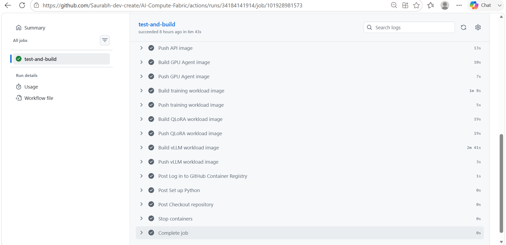

*Successful GitHub Actions CI pipeline building and publishing the API, GPU Agent, PyTorch training, QLoRA, and vLLM workload images to the container registry.*

```text
Admission
GPU inventory
GPU allocation
Scheduling
Priority queue processing
Job lifecycle
Persistence
Workload execution
Kubernetes adapter behavior
Runtime observation
Artifact service
Artifact API
S3 artifact publication
Managed inference
MCP integration
```

At the final implementation checkpoint:

```text
156 tests passed
```

CI is implemented with **GitHub Actions**.

The CI pipeline was also used to build and publish immutable workload/container revisions used during real infrastructure validation.

Automated tests complement rather than replace the real AWS/EKS validation performed throughout the project.

---

# 24. Screenshots / Engineering Evidence

The project was validated progressively with real infrastructure evidence.

Recommended portfolio evidence includes:

### Real NVIDIA T4 / CUDA

Evidence of the real EKS GPU node and CUDA-visible Tesla T4.

```text
NVIDIA Tesla T4
CUDA Available
Kubernetes GPU Resource
```

### PyTorch Training

Real scheduler-to-GPU training with decreasing loss and terminal lifecycle reconciliation.

### QLoRA Fine-Tuning

```text
Tesla T4
Qwen/Qwen2.5-0.5B-Instruct
4-bit QLoRA
Loss 4.875 → 3.618
Adapter generated
```

### vLLM Inference

Real scheduler-driven model serving through Kubernetes Deployment/Service and an OpenAI-compatible inference API.

### Artifact Lifecycle

```text
QLoRA
 ↓
S3
 ↓
PostgreSQL
 ↓
Artifact API
```

### AWS Bedrock

Real managed inference response with usage and AWS request metadata.

### MCP

Real Kubernetes cluster information retrieved through the MCP architecture.

### Grafana

Control-plane dashboards covering scheduling, job lifecycle, GPU state, and accelerator telemetry.

> Portfolio screenshots and architecture diagrams are maintained under `docs/images/` as the documentation is finalized.

---

# 25. Engineering Journey

The project was intentionally built in layers rather than beginning with EKS.

```text
Domain Foundation
      ↓
GPU Inventory
      ↓
Admission Control
      ↓
Priority Queue
      ↓
AI-Aware Scheduler
      ↓
GPU Allocation
      ↓
Job Lifecycle
      ↓
PostgreSQL Persistence
      ↓
Prometheus / Grafana
      ↓
Workload Runner
      ↓
Kubernetes Execution Adapter
      ↓
AWS EKS
      ↓
Dynamic GPU Discovery
      ↓
Real Tesla T4 Scheduling
      ↓
Runtime Observation / Reconciliation
      ↓
Real PyTorch Training
      ↓
Real QLoRA Fine-Tuning
      ↓
vLLM Model Serving
      ↓
AWS Bedrock Managed Inference
      ↓
DevOps MCP
      ↓
S3 + IRSA Artifact Storage
      ↓
Artifact API + PostgreSQL Metadata
      ↓
Real QLoRA → S3 → PostgreSQL → API
```

This progression was deliberate.

The control plane existed before real infrastructure was attached to it, allowing AWS and Kubernetes to remain execution mechanisms rather than becoming the architecture itself.

---

# 26. Known Limitations

AI Compute Fabric is a portfolio-scale engineering implementation rather than a production SaaS offering.

Current limitations and deliberately deferred production concerns include:

- single-region AWS deployment
- non-HA development infrastructure
- one GPU node during real validation
- no distributed multi-node training
- no advanced scheduler preemption
- no production-grade fairness algorithm
- limited queue starvation protection
- no production multi-tenancy model
- no full authentication/authorization platform
- no automatic GPU node autoscaling policy driven by queued workload demand
- no multi-cluster scheduler
- no multi-cloud GPU execution adapter
- no production disaster-recovery implementation
- development-grade Prometheus persistence
- limited provider-specific Bedrock error normalization
- some lifecycle/idempotency edge cases remain intentionally documented as engineering debt

One known queue edge case exists when an older pending job remains at the queue head while a newer HTTP submission expects an immediate scheduling decision. This requires further queue/orchestrator consistency hardening for production use.

These limitations are intentionally documented rather than hidden because the purpose of the project is to demonstrate architecture, infrastructure reasoning, and real AI workload execution—not claim production maturity that has not been implemented.

---

# 27. Project Status

## Core Implementation: Complete

The final validated architecture demonstrates:

```text
AI Workload
      ↓
Admission
      ↓
Priority Queue
      ↓
AI-Aware Scheduling
      ↓
GPU Allocation
      ↓
Real Kubernetes Execution
      ↓
Runtime Observation
      ↓
Training / Fine-Tuning / Inference
      ↓
Artifact Persistence
      ↓
Observability
```

Real infrastructure validation includes:

```text
Amazon EKS
NVIDIA Tesla T4
CUDA
PyTorch
Qwen2.5
4-bit QLoRA
vLLM
Amazon S3
PostgreSQL
IRSA
AWS Bedrock
Model Context Protocol
Prometheus
Grafana
Terraform
```

The final QLoRA validation demonstrated:

```text
Real Tesla T4
      ↓
CUDA
      ↓
Qwen2.5 4-bit QLoRA
      ↓
Loss Reduction
      ↓
PEFT Adapter
      ↓
Amazon S3
      ↓
PostgreSQL Metadata
      ↓
ArtifactService
      ↓
Artifact REST API
```

After validation, the expensive Terraform-managed EKS, GPU, CPU node group, NAT, and networking infrastructure was deliberately destroyed.

The trained QLoRA artifact was retained in private Amazon S3 storage as durable output from the final workload.

---

## Final Positioning

AI Compute Fabric demonstrates the engineering layer between:

```text
                  AI WORKLOADS
                       │
                       ▼
             ┌──────────────────┐
             │ AI Compute Fabric│
             │                  │
             │ Admission        │
             │ Queueing         │
             │ Scheduling       │
             │ GPU Management   │
             │ Execution        │
             │ Reconciliation   │
             │ Artifacts        │
             │ Observability    │
             └────────┬─────────┘
                      │
          ┌───────────┴────────────┐
          ▼                        ▼
  SELF-HOSTED COMPUTE        MANAGED COMPUTE
          │                        │
     Kubernetes / EKS          AWS Bedrock
          │
      NVIDIA GPU
          │
   Training / Inference
```

It is not intended to replace Kubernetes, EKS, vLLM, or managed model providers.

It demonstrates how an **AI-aware compute control plane can coordinate those systems into a unified workload lifecycle.**

---

**Primary portfolio focus:** AI Infrastructure Engineering / AI Platform Engineering

**Core themes:** GPU Scheduling · Kubernetes · AI Workload Orchestration · LLM Training · Model Serving · Artifact Lifecycle · Observability · AWS · Infrastructure as Code
